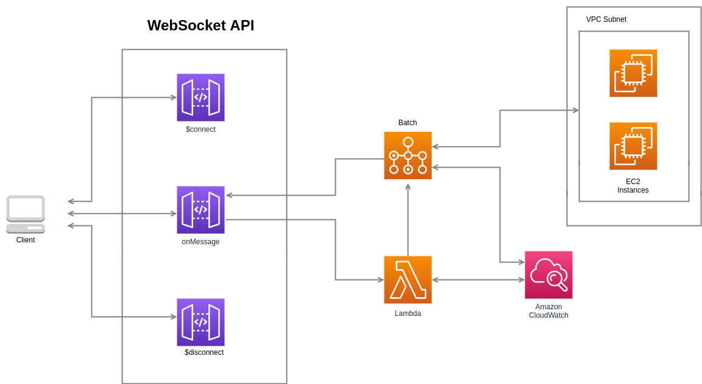

# Words detector supported in batch processing

This application consist in a script that searches inside a matrix all words in english using Depth Fisrt Search algorithm.

It traverses all possible paths from all nodes to all nodes with the purpose of visiting neighbour nodes both in horizontal or vertical way and append letters to find words by making comparisons with the help of pyenchant library.

# Continuous Deployment

The continuous deployment of the solution is supported in Docker Hub, wich is set up so that each commit to this GitHub repo be immediately processed.

Once Docker Hub has finished its process, the image will be available to be run by a job definition in AWS Batch.

# Process summary

An API Gateway Websocket was used to enable bidirectional communication between client and server. When a message arrives, onMessage API sends the incoming data (matrix) to a Lambda function and this one invoke the batch service to execute the algorithm and return a response based on the client connection id through the same onMessage API. All the previous with its respective policies attached in IAM service.

In the following image, can be seen the flow of data betwen client and AWS components.

# What about performance?

The present solution has a high algorithmic complexity and therefore, when a matrix of a considerable size is sent to batch, it'll take also a considerable amount of time to be solved.

So, is there a more efficient way of performing this task? Yes, indeed. There is a technique called memoization that supported on tries enhances the performance of the task by reducing the algorithmic complexity. It will be released soon to this repo.
